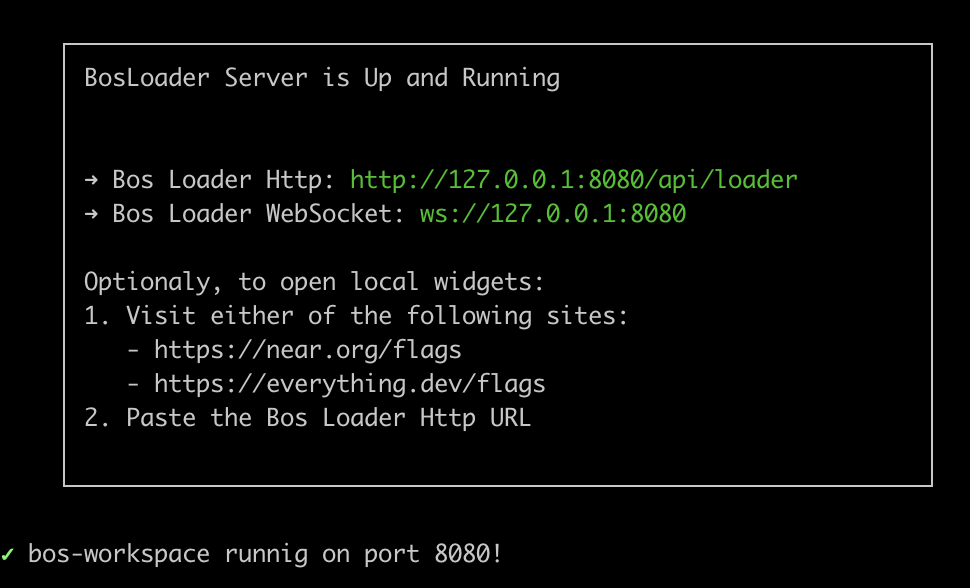

# tldraw.near

—> [near-bos-webcomponent](https://github.com/petersalomonsen/near-bos-webcomponent) with [tldraw](https://tldraw.dev/) installed, deployed to [web4](https://web4.near.page/), to provide a sandbox for builders wanting to create apps with the canvas.

## before you begin

These packages utilize `pnpm` for monorepo capabilities.

```cmd
npm install -g pnpm
```

Then, we need to init the git submodules:

```cmd
pnpm run init
```

and install dependencies:

```cmd
pnpm install
```

**Note:** In order to run everything on M1 processors, the following steps are also needed:
- Make sure Xcode Command Line Tools are installed: `xcode-select --install`;
- Make sure you have a supported Python version (works with 3.11, but not with 3.12);
- Make sure you are using Node version 18.

Reference: [node-gyp on macOS](https://github.com/nodejs/node-gyp?tab=readme-ov-file#on-macos)

## get started

To modify existing widgets in the /apps directory,

```cmd
pnpm run dev
```



This will serve the widgets in ./apps to a basic gateway. To view your local widgets, use one of the below methods:

- *Beginner* ~ use the default bos-workspace gateway with default VM, http://localhost:8080
- *Intermediate* ~ set flags on existing gateways like [near.org](https://near.org/flags) or [everything.dev](https://everything.dev/flags)
- *Advanced* ~ set flags on the local gateway hooked up to this monorepo's VM

## deploy to web4

(needs [bos-cli-rs](https://github.com/bos-cli-rs/bos-cli-rs))

1. create a subaccount

```cmd
near account create-account fund-myself web4.alice.near '1 NEAR' autogenerate-new-keypair save-to-keychain sign-as alice.near network-config mainnet sign-with-keychain send
```

2. deploy [minimum web4 contract](https://github.com/vgrichina/web4-min-contract)

```cmd
cd packages/web4-deploy/data

near contract deploy web4.alice.near use-file web4-min.wasm without-init-call network-config mainnet sign-with-keychain send
```

3. change default widgetSrc in `near-bos-webcomponent/src/App#24` and build

```cmd
cd near-bos-webcomponent
yarn build
```

4. export keys to use in web4 deploy of `dist`

```cmd
near account export-account web4.alice.near using-private-key network-config mainnet

NEAR_ENV=mainnet NEAR_SIGNER_KEY=${PRIVATE_KEY} npx web4-deploy dist web4.alice.near --nearfs
```

5. done, app deployed at alice.near.page
